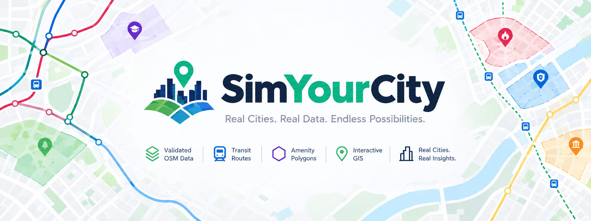
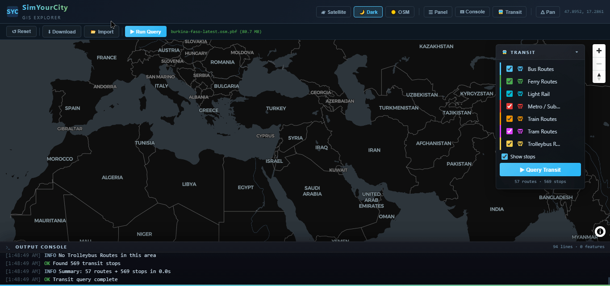
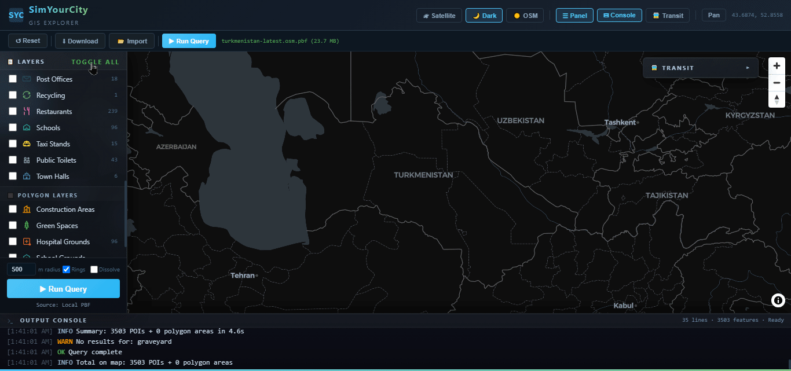
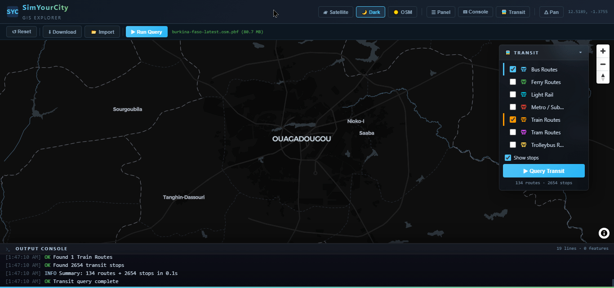

<p align="center">
  
</p>

[](https://opensource.org/licenses/MIT)


# SimYourCity

A fully open-source full-stack GIS explorer for querying and visualizing OpenStreetMap amenity and landuse data. Supports amenity points, polygon layers, landuse, and transit routes from PBF files or the Overpass API.

`#OpenStreetMap` `#OSM` `#GIS` `#Python` `#Osmium` `#pyosmium` `#GeoFabrik` `#CARTO` `#OverpassAPI` `#Flask` `#MapLibre` `#Shapely` `#GeoJSON` `#Mapping` `#UrbanPlanning` `#Transit` `#OpenData`

> **Built entirely with [OpenCode](https://opencode.ai) using [MiMo V2.5](https://huggingface.co/XiaomiMiMo/MiMo-7B-RL)** — from architecture design to final implementation, every line of code was generated through AI-assisted development.

## Features

- **Amenity Explorer** — 25 amenity types (fuel, police, hospital, school, pharmacy, restaurant, etc.) with radius rings and optional dissolve
- **Polygon Layers** — construction sites, universities, schools, hospitals, green spaces
- **Transit Routes** — bus, train, subway, trolleybus, tram, light rail, ferry lines with stops
- **PBF File Management** — download from GeoFabrik, import local files, select active dataset
- **Satellite/Dark/Light** — three base map styles with seamless switching
- **Glass UI** — translucent panels with backdrop blur, resizable sidebar, collapsible console

## Screenshots

<table>
  <tr>
    <td align="center" width="50%">
      
      <br>
      <sub><b>Download</b> — pick any of 188 countries from the GeoFabrik catalog and fetch the OSM extract with live progress</sub>
    </td>
    <td align="center" width="50%">
      
      <br>
      <sub><b>Amenities</b> — 25 point types populate the map with radius rings and dissolve</sub>
    </td>
  </tr>
  <tr>
    <td align="center" colspan="2">
      
      <br>
      <sub><b>Transit</b> — bus, train, subway, tram and ferry routes drawn with their stops</sub>
    </td>
  </tr>
</table>

## Requirements

- Python 3.10+
- Flask, requests, shapely, osmium (see `requirements.txt`)

## Setup

```bash
pip install -r requirements.txt
python app.py
```

Open `http://localhost:5000` in your browser.

> **Note:** `app.py` uses Flask's built-in development server, which prints a `WARNING: This is a development server...` message. That's expected for local use. For any public/production deployment, run behind a WSGI server instead, e.g. `pip install waitress` then `waitress-serve --host=127.0.0.1 --port=5000 app:app`.

## PBF Files

Place `.osm.pbf` files in the `pbf_files/` directory, or use the toolbar to:

- **Download** — select a country from the GeoFabrik catalog and download directly
- **Import** — provide a full path to any `.osm.pbf` file on your machine
- **Select** — switch between multiple downloaded PBF files

The active PBF is tracked in `simyourcity_state.json`.

## Project Structure

```
SimYourCity/
├── app.py              Flask server + API endpoints
├── config.py           Settings, amenity/polygon/transit definitions, PBF state
├── query_engine.py     PBF scanning (pyosmium) + Overpass fallback
├── requirements.txt    Python dependencies
├── pbf_files/          Local PBF file storage
├── static/js/          Frontend JavaScript
├── templates/          HTML templates
└── simyourcity_state.json   Active PBF tracking (auto-generated)
```

## API Endpoints

| Endpoint | Method | Description |
|---|---|---|
| `/api/query` | GET | Stream amenity/polygon query results (SSE) |
| `/api/transit` | GET | Stream transit route/stop data (SSE) |
| `/api/pbf/status` | GET | List PBF files and active selection |
| `/api/pbf/select` | POST | Set active PBF file |
| `/api/pbf/import` | POST | Import a PBF from a local path |
| `/api/pbf/delete` | POST | Delete a PBF file |
| `/api/pbf/geofabrik` | GET | GeoFabrik catalog (continent/country list) |
| `/api/pbf/download` | POST | Start background download from GeoFabrik |
| `/api/pbf/download/<task_id>` | GET | Poll download progress |
| `/api/reset` | POST | Clear active PBF, revert to Overpass |

## Data Source

- **With PBF loaded** — fast local queries via pyosmium (no network required) **HIGHLY RECOMMENDED**
- **Without PBF** — queries fall back to the Overpass API (requires internet)

> **⚠️ Overpass etiquette** — When no PBF is loaded (or on the GitHub Pages static site), every query hits the public [Overpass API](https://overpass-api.de). That service is a shared, volunteer-run resource: repeated or large-area queries can get your IP rate-limited or temporarily blocked. Prefer loading a local PBF for heavy use, keep the map viewport small, and avoid hammering Run. See the [Overpass FAQ](https://wiki.openstreetmap.org/wiki/Overpass_API/FAQ#Usage_policies).

## License

This project is licensed under the [MIT License](LICENSE).

## Attribution

Map data © [OpenStreetMap](https://www.openstreetmap.org/copyright) contributors. OSM data is available under the [ODbL license](https://opendatacommons.org/licenses/odbl/1-0/). Basemaps by [CARTO](https://carto.com/attributions).

## Built with OpenCode

This project was developed entirely inside [OpenCode](https://opencode.ai), an AI-powered coding agent, using the **MiMo V2.5** model. Every feature — from the pyosmium-based PBF scanner and dissolve geometry engine to the glassmorphism UI and SSE streaming endpoints — was designed, implemented, and debugged through conversational AI assistance.

**What OpenCode handled:**
- Full backend architecture (Flask, pyosmium, Overpass API integration)
- Frontend implementation (MapLibre GL, vanilla JS, glassmorphism CSS)
- PBF file management (GeoFabrik catalog, background download threading)
- Transit route parsing from OSM relation members
- Polygon dissolve via Shapely union operations
- Iterative debugging of pyosmium API quirks (KeyFilter, sparse_file_array indexing, two-pass transit scan)

**Tag:** `@opencode` `@mimo-v2.5`
